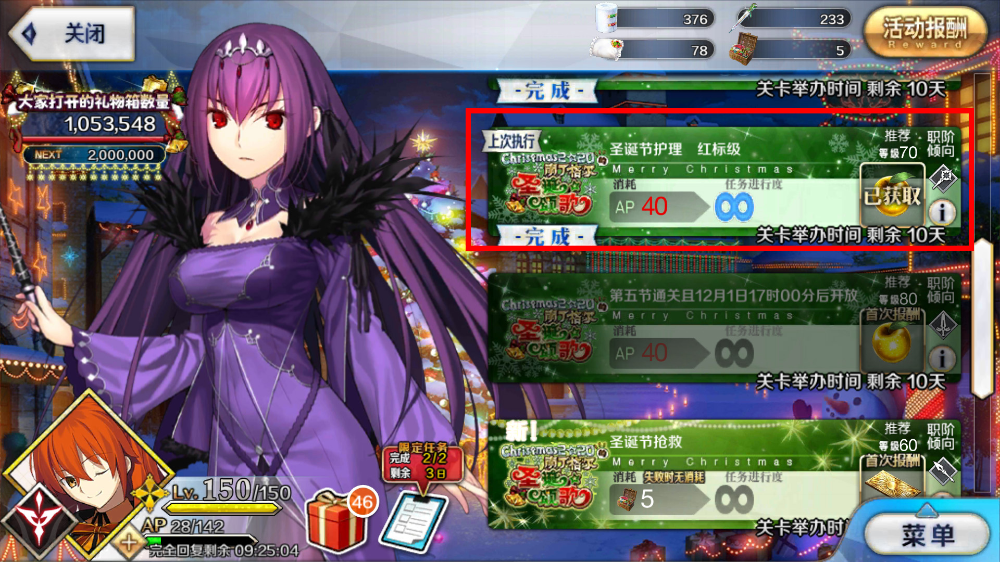
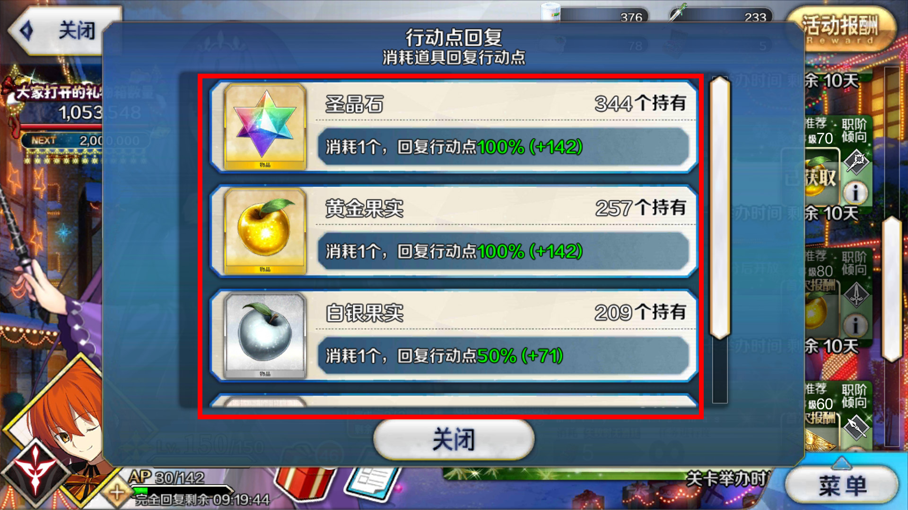
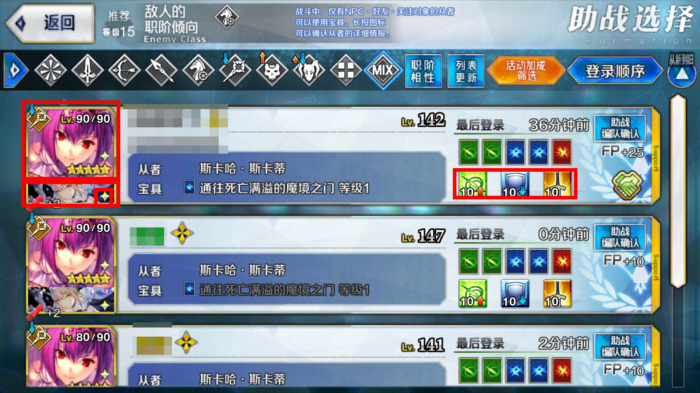
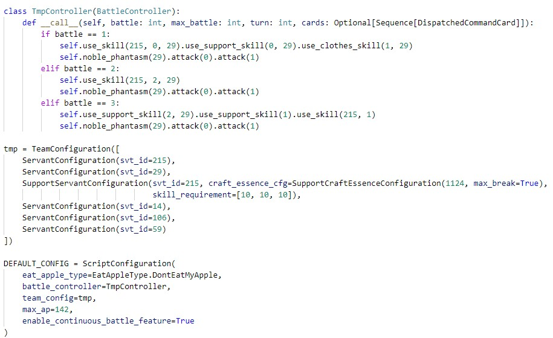
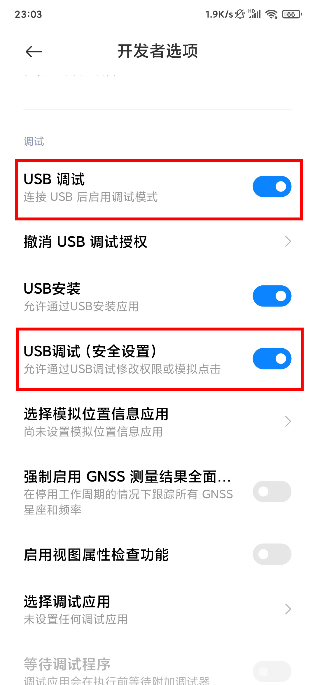

# BgoScript

废狗半放置式挂机脚本，纯图片识别+模拟点击实现，从闪闪祭开始挂无限池用的，纯属娱乐产物

# 免责声明

**本脚本仅用作学术研究，严禁一切商业行为！**

**本项目与本人所属的实验室团队及科研项目无关，并且仅在摸鱼时候完成。**

**任何使用该脚本导致账号封禁的，开发者不承担任何责任。**


# 使用说明

适用人群：适合有一定编程经验的人使用

本脚本自动执行的操作为：
- 点击第一个本（不要进还没首次通关的本）

- 啃金银铜彩苹果（AP不够时根据设置执行）

- 根据队伍配置自动选择符合从者和礼装的助战（指定从者、礼装ID，礼装是否满破，从者技能等级，是否需要为好友）

- 自动进本
- 每T都会调用函数确定本T需要进行哪些操作（该部分由用户自己实现，在`config.py`里面修改，注：不支持我方从者的阵亡检测）

- 自动出本，跳过好友请求
- 使用连续出击则返回第3步，否则返回第1步（由设置决定）

本脚本的全局设置在`config.py`里，其中：

`TmpController`中的`__call__`负责决定每T战斗需要执行的操作，包括使用技能，放宝具，选卡。

`ScriptConfiguration`为全局设置，初始化参数如下：  
`eat_apple_type`决定是否吃苹果以及吃的苹果类型，若不吃苹果，则会在AP不足时退出执行；  
`battle_controller`是负责执行自动战斗操作的类；  
`team_config`为队伍设置（未实现配队功能），初始化的参数为队伍的顺序，目前仅作选助战用；  
`max_ap`可选的最大AP值；  
`enable_continuous_battle_feature`为是否使用连续出击，默认true，就算是否也只是退到选关界面再进去而已。

## BattleController的API

全部可以直接`self.`调用，详细可以见`fsm/battle_seq_executor.py`下的`BattleSequenceExecutor`类的所有公开方法。主要包含：
- 常量：
    - `ENEMY_LOCATION_EMPTY`：技能/宝具/攻击不指定敌方目标
    - `SERVANT_ID_EMPTY`：技能目标不指定我方单体
    - `SERVANT_ID_SUPPORT`：使用技能的从者/技能目标指定为助战从者（因为ID可能会重复）
- 方法：
    - `remove_servant(servant_id: int)`：从队伍中移除指定从者，比如大英雄NP满了之后需要手动移除（助战则使用`servant_id=SERVANT_ID_SUPPORT`或直接调用`remove_support_servant()`）
    - `remove_support_servant()`：从队伍中移除助战从者
    - `order_change(svt_id1: int, svt_id2: int)`：交换两名从者的位置，对助战从者则指定为`SERVANT_ID_SUPPORT`
    - `use_skill(servant_id: int, skill_index: int, to_servant_id: int = SERVANT_ID_EMPTY, enemy_location: int = ENEMY_LOCATION_EMPTY)`：使用技能。发起方由`servant_id`指定，为发起方的从者ID；`skill_index`从0开始从左到右计数，最左边的技能为0，最右边为2；`to_servant_id`为技能作用的我方目标从者ID；`enemy_location`为技能作用的敌方目标，从0开始从左到右计数，最左边的敌方目标为0，最右边为2
    - `use_support_skill(skill_index: int, to_servant_id: int = SERVANT_ID_EMPTY, enemy_location: int = ENEMY_LOCATION_EMPTY)`：同上，只是自动填了`servant_id=SERVANT_ID_SUPPORT`
    - `noble_phantasm(servant_id: int, enemy_location: int = ENEMY_LOCATION_EMPTY)`：放宝具，该操作执行在所有技能点完之后，参数同上
    - `support_noble_phantasm(enemy_location: int = ENEMY_LOCATION_EMPTY)`：同上
    - `attack(command_card_index: int, enemy_location: int = ENEMY_LOCATION_EMPTY)`：选指令卡，该操作执行在所有技能点完之后，`command_card_index`为指令卡的位置，从0开始从左计数，最左边的卡为0，最右边为4，其他参数同上
    - `use_clothes_skill(skill_index: int, to_servant_id: Union[int, Tuple[int, int]] = SERVANT_ID_EMPTY, enemy_location: int = ENEMY_LOCATION_EMPTY)`：使用衣服技能，参数同上。`to_servant_id`在接受到int为参数（如`to_servant_id=2`时），将技能交给指定的从者，而在接受2个int为参数时（如`to_servant_id=(1,2)`），则视为使用换人（唯一一个特殊用法），并且自动交换队伍顺序，不需要手动调用`order_change`

# 环境需求

## Python

Python 3.6 +

其他依赖包：
- `numpy`
- `pillow`
- `scipy`
- `scikit-image`
- `opencv-python`（推荐使用4.4以后的版本，包含SIFT模块）

使用OpenCV时，需要确保其中一个生效：
```python
import cv2
cv2.SIFT.create()  # OpenCV 4.4.x
cv2.xfeatures2d_SIFT.create()  # OpenCV 3.x
```

## 模拟器需求

目前代码支持Mumu模拟器，模拟器画面的宽高比必须是16:9，否则图片识别会失效，推荐常用的分辨率是`1280x720`和`1920x1080`。在运行脚本过程中，不要最小化模拟器，确保模拟器整个窗体在屏幕范围内。也不要把屏幕缩放得过小，否则识别精度会大幅下降。

其他模拟器则需要自己继承`HandleBasedAttacher`实现一下查找窗体句柄（`locate_handle`）那部分代码就行。找窗体句柄可以用VS自带的`spy++`，找的时候注意这个窗体是能响应鼠标事件并且能获得屏幕截图的就行了。

## 手机使用需求

仅支持安卓。需要下载最新的ADB (Android Debug Bridge)，并且添加到`PATH`环境变量中，确保手机开启开发者模式，并且开启USB调试。若有涉及发送点击相关的安全选项，也需要开启。最后，用数据线将手机连电脑上即可。



## 使用方式

1. 下载并解压数据库文件（包含从者、礼装图片的数据）[fgo_new.db](https://cdn.zhouxuebin.club/data/2020/11/fgo_new.zip)到`cv_data`文件夹中。
2. 运行脚本：默认使用Mumu模拟器，执行完整的进本
```bash
python main.py
```
也可以通过第一个命令行参数指定控制对象，如用`mumu`使用模拟器或者是用参数`adb`控制手机：
```bash
python main.py mumu
```
或
```bash
python main.py adb
```
若需要修改执行流程，则通过`--schemas`修改（如默认的`full`实现的是重复刷本，`support`仅自动选择助战，`battle`仅包含进本后的自动化操作），如：
```bash
python main.py mumu --schemas support
```
*若要修改助战选择，请在`config.py`下改，将来会把这个参数加到命令行里就不需要修改文件了*


# ROADMAP

- [x] 代码重构
- [x] 识别助战各技能等级
- [x] 识别助战为好友/非好友
- [ ] 自动配队

# 其他说明

需要更新从者/礼装数据库时，运行：
```bash
python update_script/crawler_main.py -o cv_data/fgo_new.db
```
需要安装的额外依赖包有：`requests`，`beautifulsoup4`，`pandas`


<!--
# ~~Special Thanks~~

~~某热心催促完成脚本大业的沙雕室友~~
-->


